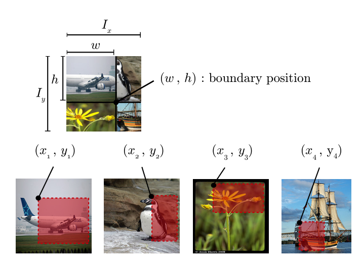

# Overview

​	在图像分类中，数据增强是必不可少的步骤，合适的数据增强可以增加模型的泛化能力，取得更好的分类精度。本文旨在整个在图像分类任务上最近一些比较实用的方法，并给出简单的实现过程，在具体的实验中，并不能确保哪种数据增强策略是比较理想的，需要在实际的数据中合适的选择。

​	本文主要涉及以下数据增强策略：

- Cutout
  - DeVries, Terrance, and Graham W. Taylor. "Improved Regularization of Convolutional Neural Networks with Cutout." arXiv preprint arXiv:1708.04552 (2017). [arXiv:1708.04552](https://arxiv.org/abs/1708.04552), [PyTorch implementation](https://github.com/uoguelph-mlrg/Cutout)
- RandomErase
  - Zhong, Zhun, Liang Zheng, Guoliang Kang, Shaozi Li, and Yi Yang. "Random Erasing Data Augmentation." arXiv preprint arXiv:1708.04896 (2017). [arXiv:1708.04896](https://arxiv.org/abs/1708.04896), [PyTorch implementation](https://github.com/zhunzhong07/Random-Erasing)
- AutoAug
  - Cubuk E D , Zoph B , Mane D , et al. AutoAugment: Learning Augmentation Policies from Data[J]. 2018.
- Mixup
  - Zhang, Hongyi, Moustapha Cisse, Yann N. Dauphin, and David Lopez-Paz. "mixup: Beyond Empirical Risk Minimization." In International Conference on Learning Representations (ICLR), 2017. [link](https://openreview.net/forum?id=r1Ddp1-Rb), [arXiv:1710.09412](https://arxiv.org/abs/1710.09412)
  - Zhang Z, He T, Zhang H, et al. Bag of freebies for training object detection neural networks[J]. arXiv preprint arXiv:1902.04103, 2019.
- Cutmix
  - Yun, Sangdoo, Dongyoon Han, Seong Joon Oh, Sanghyuk Chun, Junsuk Choe, and Youngjoon Yoo. "CutMix: Regularization Strategy to Train Strong Classifiers with Localizable Features." arXiv preprint arXiv:1905.04899 (2019). [arXiv:1905.04899](https://arxiv.org/abs/1905.04899)
- RICAP
  - Takahashi, Ryo, Takashi Matsubara, and Kuniaki Uehara. "Data Augmentation using Random Image Cropping and Patching for Deep CNNs." Proceedings of The 10th Asian Conference on Machine Learning (ACML), 2018. [link](http://proceedings.mlr.press/v95/takahashi18a.html), [arXiv:1811.09030](https://arxiv.org/abs/1811.09030)

# Cutout 

​	Cutout的具体实现效果如上图所示，使用固定大小的正方形的patch在零均值化的图像上随机擦除，擦除的位置变为0. 原文指出，在超参设置上cutout的面积大小比形状更重要，并且在实验过程中发现通过按照50%的比例使用cutout和原图训练的模型往往取得更好的效果。

​	Cutout变种有：Dual-Cutout，RandomErase

# RandomErase

RandomErase的具体实现效果如上图所示，对比cutout而言，引入了形状、填充值等变化，不是简单的使用方形，而是使用了不同长宽比进行擦除，擦除的填充值采用了随机值，一般实现上使用图像的均值效果差别不大。

RandomErase原文不仅在图像分类进行了实验，在ReID任务上也进行了比较，提分比较明显。

# AutoAug

AutoAug定义了一些涉及仿射变换、旋转等子策略，通过搜索算法在目标数据集上搜索对应得概率和幅值。在竞赛时间、数据量大、资源有限得情况下，我们可以使用Imagenet上学习得到得子策略进行增强(增强效果如下图所示)。这种增强往往并不一定有效，比如之前在我们的一个数据集上，seresnext101_32x8d使用autoaug反而掉点，但是在使用resnest101的实验中，涨幅十分明显，并且超过了最优的seresnext101_32x8d（对比没使用autoaug的配置，resnest101比seresnext101更低）。因此有时候，有必要组合多种条件进行调参。

# Mixup

mixup会在一个batch内随机选择两张图片（A,B）进行融合，融合的权重λ从beta分布采样得到，然后对两张图像的标签分别计算损失，并使用λ，1-λ进行加权求和。具体效果可以看cutmix小节的效果图。

mixup在yolov3系列中检测也经常用到,具体可参考Bag of freebies for training object detection neural networks

# Cutmix

如图所示，Cutmix在具体实现上会在一个batch内随机选择两张图片（A,B）进行融合，具体的，以其中一张A作为画布，并使用（0-1）均匀分布选择融合的面积比lambda，从另外一张图片B随机裁剪与其一样长宽比的patch,随机的黏贴到A上。在loss的计算上，按照**校准后** 1-lambda, lambda 的比例计算对应的分类损失即可

# RICAP

RICAP全称Random Image Cropping and Patching, RICAP会在会在一个batch内随机选择四张图片（A,B,C,D）进行融合,具体地，从beta分布采样ratio_x,ratio_y，根据预定义好的图像尺寸生成中间点（w，h）,然后再随机从其他图像裁剪一块图像黏贴到对应位置，在损失函数计算上，更加采样窗口的比例进行加权求和

ricap在检测中有个类似的应用Stitcher（[Sitcher: Feedback-driven Data Provider for Object Detection
  ](https://link.zhihu.com/?target=https%3A//arxiv.org/pdf/2004.12432.pdf)）

# 后话

本文列举的数据增强并不算多，但是如何用好这些需要图像算法工程师的仔细调参，比如在我们的一个数据集中，我们进行了模型resnest和senext的对比实验，加入了autaug对resnest的提升比较大，对senext提升并不明显；在cutmix和ricap的实验中，使用小batchsize的RICAP效果更理想，使用大batchsize的cutmix效果更优，当然这可能跟数据集有关，但是不可否认的是数据增强策略和模型及其超参可能存在一定的耦合，如果是竞赛的话，可以尝试多种组合策略。

# 参考：

本文的主要参考内容如下：

- https://github.com/hysts/pytorch_image_classification