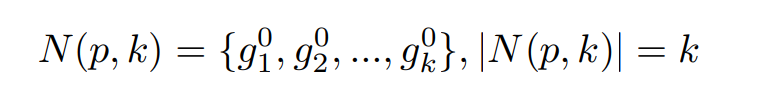
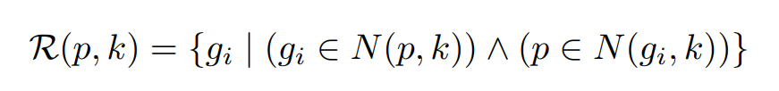
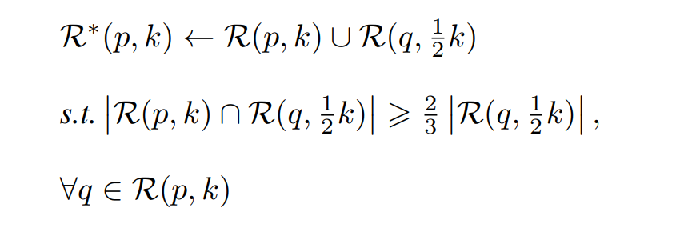
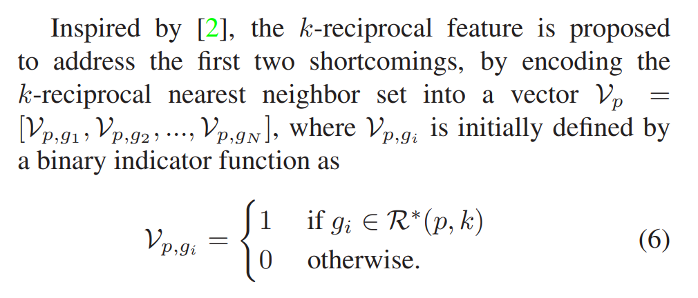
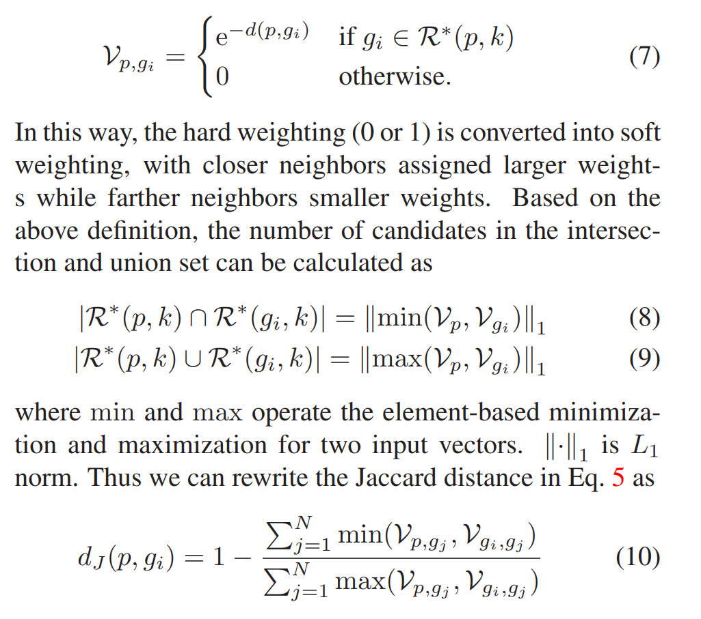
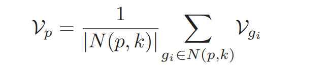

## Abstract

​		在图像检索过程中，或者ReID(将 Re-ID看作一个检索过程时)，re-ranking是提高其准确性的关键步骤，是各大竞赛刷榜得利器。

​		Re-Ranking的思想基于这么一个假设：

​		*if a gallery image is similar to the probe in the k-reciprocal nearest neighbors, it is more likely to be a true match.*

​		简单的解释就是，根据probe在**probes+galleries**搜索出来的candidate对象，根据这些candidate对象在**probes+galleries**选择k个nearest，如果包含你的probe，那它的可能性更大一些。

## Information

Paper: (CVPR2017) Re-ranking Person Re-identification with k-reciprocal Encoding.

Code: 

- (matlab) https://github.com/zhunzhong07/person-re-ranking
- (python cpu:代码简洁，使用堆排序加速，k reciprocal nearest neighbors没有去重)  https://github.com/layumi/Person_reID_baseline_pytorch/
- (pytorch gpu) https://github.com/michuanhaohao/reid-strong-baseline

Reference:

- https://blog.csdn.net/lwplwf/article/details/84862054
- 谁能解释下 行人重识别reranking的原理？ - linolzhang的回答 - 知乎
  https://www.zhihu.com/question/271308170/answer/361943914
- https://zhuanlan.zhihu.com/p/36834023

## Approach Description

### K-reciprocal Nearest Neighbors

​	回顾常规检索过程，probe(p)在galleries检索的topk({g1,g2,..,}),定义为：

​	k-reciprocal nearest neighbors定义为：

​	probe(p)在**probes+galleries**检索的topk的candidates对象（不包含p），如果这些candidates对象在**probes+galleries**选泽的topk包含了p,则该candidate与p互为top-k。

​	有时候probe的匹配图片不在probe的top-k之中，这时候使用下面的方法进行召回：

​	简单的解释就是，对任一q属于k-reciprocal nearest neightbors, 求R(q,k/2)； 若R(q,k/2)与R(p,k)的交集数量大于2/3的|R(q,k/2)|，则将R(q,k/2)合并到R(p,k)，得到expanded k-reciprocalnearest neightbors.

### Jaccard Distance

​	若probe和gallery的两个图片的k-reciprocal nearest neighbor重叠的越多，可以认为两张图片越近似：

​	可以使用该距离做为**新的度量方式**，但是该方法存在几个缺点：

（1）时间复杂度高：

重新计算距离矩阵的复杂度为
$$
O((N+M)^2*k*k)
$$
N,M分别为probes, galleries的图片数量

计算expanded k-reciprocalnearest neightbors的时间复杂度为：
$$
O((N+M)*(D*(N+M)+(N+M)+k*log(N+M)+k*k/2*log(N+M)))
$$
其中, D为feature的长度，(N+M)是建堆的时间复杂度，k*log(N+M)是topk的查询复杂度，k*k/2*log(N+M))是expand的时间复杂度。

ps: 其实个人理解使用修改后的方案（k-reciprocal feature），还是要计算expanded k-reciprocalnearest neightbors，所以k-reciprocal feature并不是针对这点提出的改进。

（2）jaccard distance未考虑top-k中每张图片的权重，但显然排名高的图像权重应该更大

考虑将k-reciprocal nearest neighbor编码为向量，称为k-reciprocal feature

## k-reciprocal feature

即对属于expand k-reciprocal nearest neighbor的编码为1，否则为0，长度为probes+galleries的长度.

接下来，对编码为1的使用指数函数计算相似度：

  其中公式（8）（9）可以这样理解，对于一个向量，按元素操作，0和非零值取min代表着交集，0和非零值取max 代表着并集，其一阶范数代表这集合得大小。

## Local Query Expansion

假设相同ID的图片拥有相似的特征，因此可以使用probe的topk对Vp进行修正，注意top-k应该包含了p：

## Code

reranking 主要有3个参数： k1=20, k2=6, lambda_value=0.3

k1是计算k-reciprocal nearest neighbor的k，不宜过大，特别是存在大量只有一张图片的ID时，

k2是计算Local Query Expansion的k, 不宜过大，特别是存在大量只有一张图片的ID时，而且一般比k1小