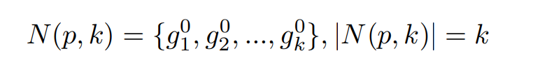

## Abstract

​		在图像检索过程中，或者ReID(将 Re-ID看作一个检索过程时)，re-ranking是提高其准确性的关键步骤，是各大竞赛刷榜得利器。

​		Re-Ranking的思想基于这么一个假设：

​		*if a gallery image is similar to the probe in the k-reciprocal nearest neighbors, it is more likely to be a true match.*

​		简单的解释就是，根据probe在**probes+galleries**搜索出来的candidate对象，根据这些candidate对象在**probes+galleries**选择k个nearest，如果包含你的probe，那它的可能性更大一些。

## Information

Paper: (CVPR2017) Re-ranking Person Re-identification with k-reciprocal Encoding.

Code: 

- (matlab) https://github.com/zhunzhong07/person-re-ranking
- (python cpu:代码简洁，使用堆排序加速，k reciprocal nearest neighbors没有去重)  https://github.com/layumi/Person_reID_baseline_pytorch/
- (pytorch gpu) https://github.com/michuanhaohao/reid-strong-baseline

Reference:

- https://blog.csdn.net/lwplwf/article/details/84862054
- 谁能解释下 行人重识别reranking的原理？ - linolzhang的回答 - 知乎
  https://www.zhihu.com/question/271308170/answer/361943914
- https://zhuanlan.zhihu.com/p/36834023

## Approach Description

### K-reciprocal Nearest Neighbors

​	回顾常规检索过程，probe(p)在galleries检索的topk({g1,g2,..,}),定义为：

​	k-reciprocal nearest neighbors定义为：

​	probe(p)在**probes+galleries**检索的topk的candidates对象（不包含p），如果这些candidates对象在**probes+galleries**选泽的topk包含了p,则该candidate与p互为top-k。

​	有时候probe的匹配图片不在probe的top-k之中，这时候使用下面的方法进行召回：

​	简单的解释就是，对任一q属于k-reciprocal nearest neightbors, 求R(q,k/2)； 若R(q,k/2)与R(p,k)的交集数量大于2/3的|R(q,k/2)|，则将R(q,k/2)合并到R(p,k)，得到expanded k-reciprocalnearest neightbors.

